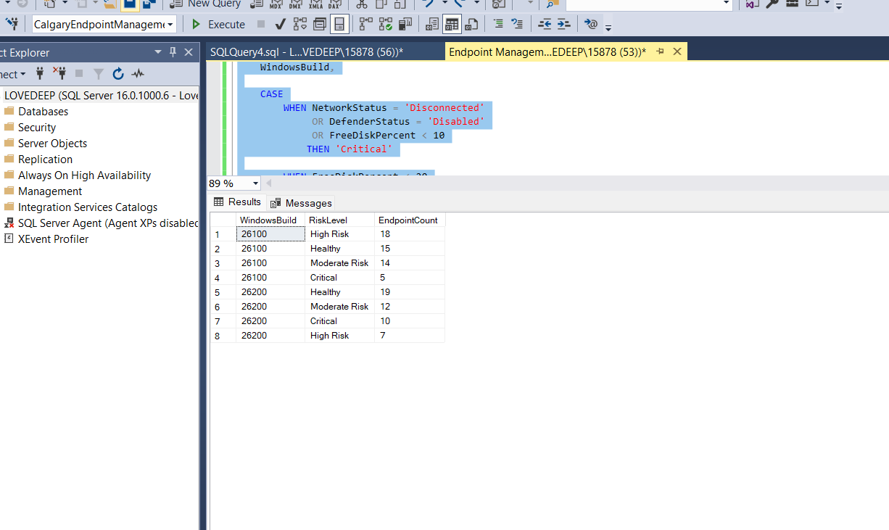
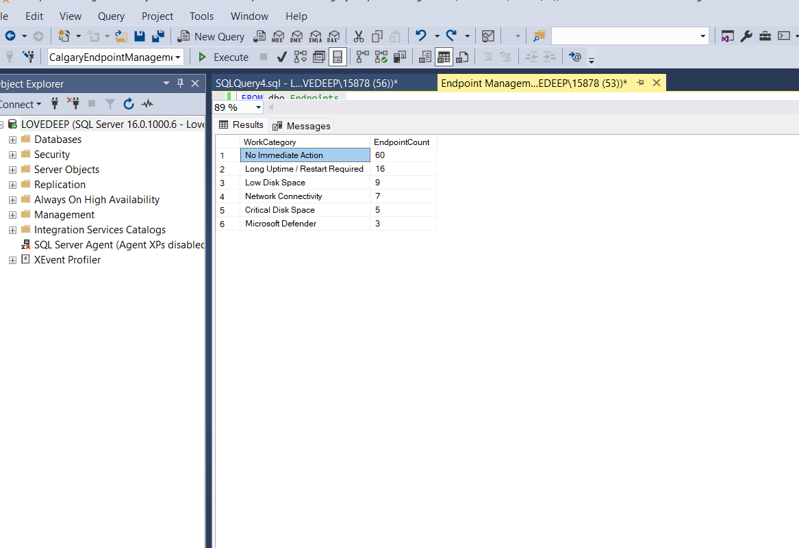
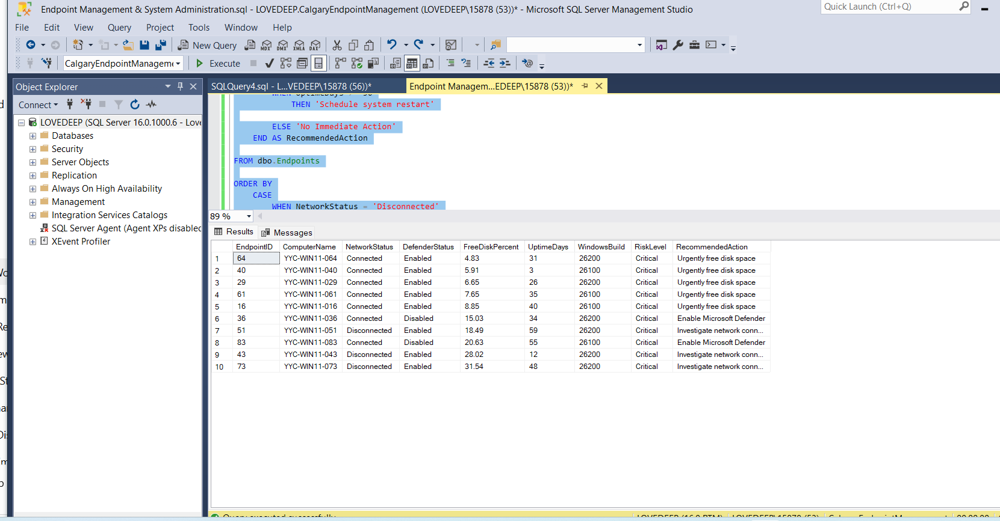
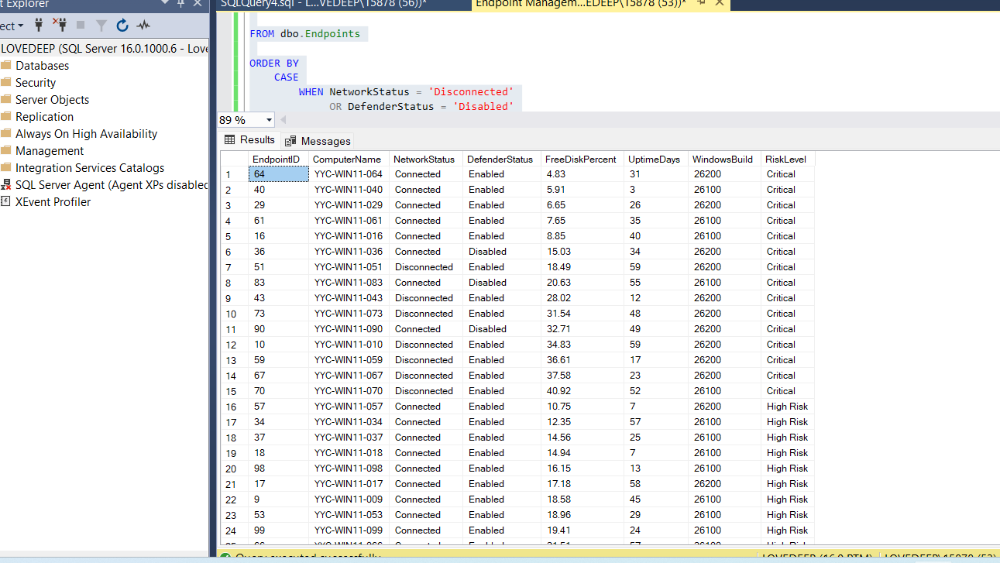

# Calgary Endpoint Management – System Administration Project

## 📌 Overview

This portfolio project simulates a **Windows endpoint management environment** and demonstrates how an IT/System Administrator can monitor endpoint health, identify operational risks, prioritize issues, and recommend remediation actions.

The project uses **Microsoft SQL Server and T-SQL** to analyze endpoint information and generate administrator-focused reports.

The simulated environment contains **100 Windows endpoints** and focuses on:

* Windows endpoint health monitoring
* Network connectivity
* Microsoft Defender status
* Disk-space management
* System uptime
* BitLocker status
* Windows build analysis
* Risk scoring and prioritization
* Administrator remediation workflows

> **Portfolio project:** This project uses a simulated dataset and does not contain City of Calgary production systems, data, or infrastructure.

---

## 🎯 Project Objectives

The project was designed to demonstrate practical IT operations and system administration concepts by:

1. Monitoring Windows endpoint health
2. Identifying endpoints requiring attention
3. Detecting network connectivity issues
4. Identifying Microsoft Defender configuration issues
5. Detecting low and critical disk space
6. Identifying systems with extended uptime
7. Assigning risk scores and priority levels
8. Creating administrator work queues
9. Generating remediation recommendations
10. Analyzing Windows build distribution and endpoint risk

---

## 🛠️ Technologies & Tools

### Systems Administration

* Windows 10/11 Endpoint Management
* Endpoint Health Monitoring
* Network Troubleshooting
* Microsoft Defender
* BitLocker
* Disk Space Management
* System Uptime Monitoring
* Windows Build Analysis
* Risk Prioritization
* Operational Reporting

### Database & Data Analysis

* Microsoft SQL Server
* T-SQL
* SQL Server Management Studio (SSMS)
* CASE expressions
* Conditional aggregation
* GROUP BY / ORDER BY
* Subqueries
* Calculated fields
* Risk scoring
* Operational reporting

### Version Control

* Git
* GitHub

---

## 🗄️ Database

**Database:** `CalgaryEndpointManagement`

**Table:** `dbo.Endpoints`

The endpoint dataset contains information such as:

* Endpoint ID
* Computer Name
* Windows Build
* Network Status
* Microsoft Defender Status
* BitLocker Status
* Endpoint Health
* Health Reason
* Free Disk Percentage
* Uptime Days

---

## ⚠️ Endpoint Risk Model

A risk score was developed to prioritize endpoints requiring administrator attention.

| Condition                   | Risk Score |
| --------------------------- | ---------: |
| Network disconnected        |        +40 |
| Microsoft Defender disabled |        +30 |
| Free disk space < 10%       |        +30 |
| Free disk space < 20%       |        +20 |
| Uptime ≥ 50 days            |        +10 |

### Priority Classification

| Risk Score | Priority |
| ---------: | -------- |
|        50+ | Critical |
|      30–49 | High     |
|      20–29 | Medium   |
|       < 20 | Low      |

This scoring model provides a simple way to identify which endpoints should receive attention first.

---

## 📊 Key Findings

Analysis of the simulated 100-endpoint environment identified:

| Metric                      | Result |
| --------------------------- | -----: |
| Total Endpoints             |    100 |
| Connected                   |     93 |
| Disconnected                |      7 |
| Microsoft Defender Enabled  |     97 |
| Microsoft Defender Disabled |      3 |
| Critical Disk Space (<10%)  |      5 |
| Low Disk Space (10–20%)     |     11 |
| Extended Uptime (≥50 days)  |     22 |

### Endpoint Risk Classification

| Risk Level    | Endpoints |
| ------------- | --------: |
| Healthy       |        34 |
| Moderate Risk |        26 |
| High Risk     |        25 |
| Critical      |        15 |

---

## 🖥️ Windows Build Analysis

The simulated environment contains two Windows builds:

| Windows Build | Endpoints |
| ------------- | --------: |
| 26100         |        52 |
| 26200         |        48 |

The project also compares Windows build distribution against endpoint risk levels to identify potential operational patterns.

> The build/risk comparison shows a relationship within this simulated dataset and does not establish that one Windows build causes higher endpoint risk.

---

## 🔎 SQL Analysis

The T-SQL analysis was designed around an administrator workflow:

**Monitor → Identify → Prioritize → Investigate → Remediate**

The SQL scripts generate:

* Endpoint risk scores
* Priority classifications
* Recommended administrator actions
* Endpoint risk reports
* Executive summaries
* Windows build reports
* Administrator work queues
* Top-priority endpoint lists
* Risk-level summaries

---

## 📸 Project Screenshots

### Risk Analysis



### Administrator Work Queue



### Top Priority Endpoints



### Risk Classification



---

## 📁 Project Structure

```text
calgary-endpoint-management-sql/
│
├── README.md
│
├── sql/
│   └── endpoint_management_analysis.sql
│
└── screenshots/
    ├── administrator-work-queue.png
    ├── risk-analysis.png
    ├── top-priority-endpoints.png
    └── risk-classification.png
```

---

## 💡 System Administration Perspective

Although SQL Server is used extensively in this project, the primary objective is **not database administration**.

SQL is being used as an operational tool to analyze endpoint information and support administrator decision-making.

The project demonstrates the ability to:

* Monitor endpoint environments
* Identify technical issues
* Analyze system health data
* Prioritize operational risks
* Recommend remediation actions
* Produce reports for IT operations

This reflects a practical approach to **Windows system administration and endpoint management**.

---

## 🚀 Future Improvements

Potential extensions to the project include:

* PowerShell-based endpoint data collection
* Automated health checks
* Windows event-log analysis
* Active Directory integration
* Microsoft Intune/endpoint management integration
* Automated remediation workflows
* Dashboard visualization

These are future development ideas and are **not currently implemented in this project**.

---

## 📌 Disclaimer

This is a personal portfolio project created for learning and demonstration purposes.

All endpoint information is simulated. No City of Calgary production systems, infrastructure, or confidential information were used.
